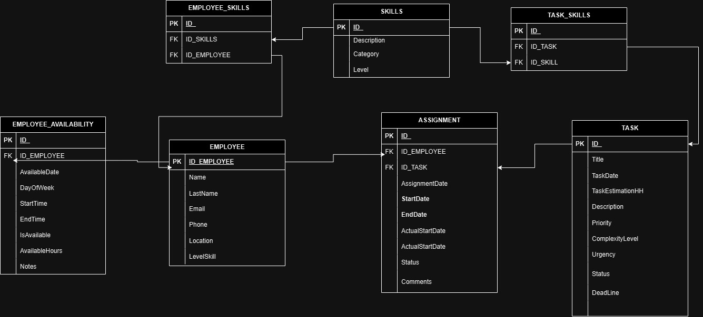

# Talent-Task-API

Talent-Task-API es una API desarrollada para gestionar la asignación óptima de tareas a empleados en función de su disponibilidad y habilidades. Este proyecto fue desarrollado como parte de un desafío técnico, optimizando el uso de los recursos de los empleados mediante algoritmos de asignación.

## Tabla de Contenidos
- [Descripción](#descripción)
- [Requisitos](#requisitos)
- [Estructura del Proyecto](#estructura-del-proyecto)
- [Modelos y Colecciones](#modelos-y-colecciones)
- [Endpoints](#endpoints)
- [Consideraciones Técnicas](#consideraciones-técnicas)

## Descripción
Esta API permite gestionar empleados y asignarles tareas de acuerdo a su disponibilidad y habilidades. Incluye:
1. Algoritmo de asignación que distribuye las tareas a los empleados de manera óptima.
2. Reporte de asignación que muestra cómo se distribuyeron las tareas en una fecha específica.

## Requisitos
- **Node.js**
- **MongoDB**
- **Docker** y **Docker Compose** (para despliegue y testing)

## Estructura del Proyecto
La estructura del proyecto es la siguiente:

```plaintext
TALENT-TASK-API/
├── controllers/
│   ├── AssignmentController.js
│   ├── AssignmentReportController.js
├── database/
│   └── connection.js
├── models/
│   ├── assignments.js
│   ├── employee.js
│   ├── employeeAvailability.js
│   ├── employeeSkills.js
│   ├── skills.js
│   ├── task.js
│   └── taskSkills.js
├── routes/
│   ├── assignmentRoutes.js
│   ├── employeeRoutes.js
├── services/
│   ├── employeeAvailabilityServices.js
│   └── taskServices.js
├── Dockerfile
├── docker-compose.yml
└── index.js
```

### Descripción de las Carpetas
- **controllers/**: Contiene los controladores de la API, encargados de manejar la lógica de negocio.
- **database/**: Archivo de conexión a la base de datos MongoDB.
- **models/**: Modelos Mongoose que representan las colecciones de MongoDB.
- **routes/**: Define las rutas de la API para las distintas operaciones CRUD.
- **services/**: Servicios que encapsulan la lógica de acceso a datos y procesamiento específico.
- 

## Modelos y Colecciones

## Arquitectura

A continuación se muestra el esquema de las colecciones y relaciones en la base de datos para la API Talent-Task-API:



Basado en el esquema ER, los modelos principales son:

- **Employee**: Información sobre el empleado, incluyendo nombre, correo, telefono.
- **Task**: Representa la tarea con título, fecha, duración.
- **Assignment**: Asignaciones de tareas a empleados.
- **Skill**: Conjunto de habilidades disponibles en el sistema.
- **EmployeeAvailability**: Disponibilidad de los empleados en días y horas.
- **EmployeeSkills** y **TaskSkills**: Relacionan empleados y tareas con sus habilidades.

## Endpoints

### Asignaciones
- **POST /assignments**: Asigna tareas a empleados de manera óptima.
- **GET /assignments/report**: Genera un reporte de asignación para una fecha específica.

## Consideraciones Técnicas

### Base de Datos y ORM
- Para la persistencia de datos, esta API utiliza **MongoDB** como base de datos NoSQL.
- **Mongoose** se emplea como el ODM (Object Data Modeling) para interactuar con MongoDB. Esto permite definir esquemas para cada colección, facilitando la validación de datos y la manipulación de documentos dentro de MongoDB.
- Se ha configurado **Mongoose** para conectarse a una base de datos llamada `talent_skill`. Este nombre debe estar especificado en la configuración de conexión de MongoDB, y la base de datos se creará automáticamente al insertar el primer documento si no existe previamente.
  
### Configuración de la Conexión
En el archivo `connection.js` dentro de la carpeta `database/`, se establece la conexión a MongoDB mediante **Mongoose**. Aquí, puedes especificar la URL de conexión en el archivo de configuración `.env`, por ejemplo:

```plaintext
MONGODB_URI=mongodb://localhost:27017/talent_skill
```

### Datos Iniciales para Poblar la Base de Datos
En la carpeta data/ se encuentran archivos JSON con los datos de ejemplo para empleados, tareas y disponibilidad. Estos archivos pueden ser utilizados para poblar la base de datos talent_skill en un entorno local, permitiendo realizar pruebas y configuraciones iniciales. Los archivos JSON incluyen:

Empleados: Datos básicos de empleados como nombre, habilidades y detalles de contacto.
Tareas: Información sobre las tareas, incluyendo título, descripción.
Skills: Listado de habilidades (programacion, diseño, documentación, pruebas).
Disponibilidad: Días y horarios en que cada empleado está disponible para trabajar.

---
## Pruebas

1. **Asignación de Tareas**
   - **Endpoint**: `POST api/assignments`
   - **Descripción**: Este endpoint permite asignar tareas a los empleados disponibles, considerando su disponibilidad y habilidades. La asignación se realiza de manera óptima para maximizar el uso de los recursos de los empleados.
   - **Parámetros**: 
     - **Fecha para procesar las tareas** : Se puede especificar una fecha para la asignación.

2. **Generación de Reporte de Asignación**
   - **Endpoint**: `GET api/report/`
   - **Descripción**: Este endpoint genera un reporte de las asignaciones realizadas para una fecha específica. Muestra cómo se distribuyeron las tareas entre los empleados, incluyendo detalles sobre el uso de tiempo y habilidades.
   - **Parámetros**:
     - **Fecha de Reporte** (requerido): Fecha para la cual se desea obtener el reporte de asignaciones.

---

